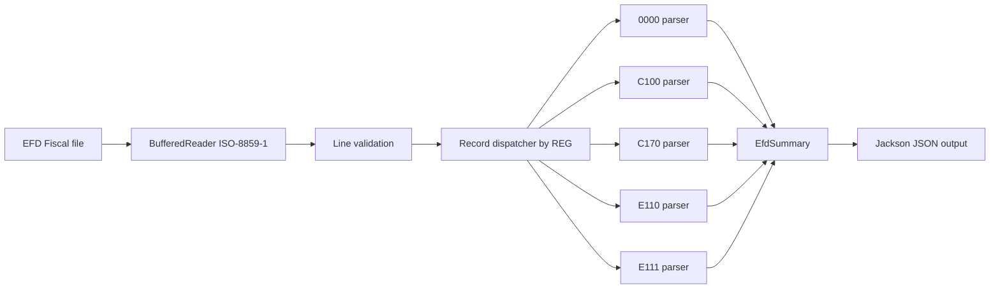
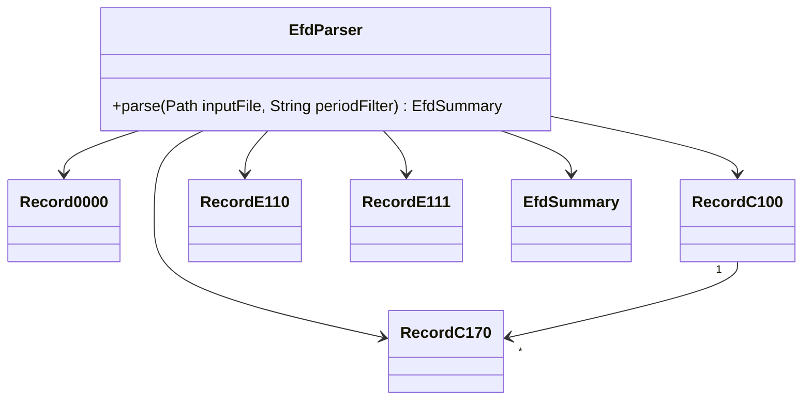
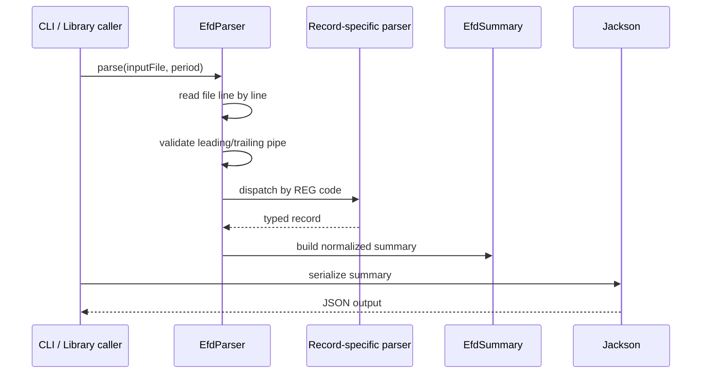

# EFD Fiscal Parser

[](https://github.com/Dolanss/EFD_PARSER/actions/workflows/ci.yml)

Java 17 library and CLI for parsing SPED EFD Fiscal flat files and producing a normalized JSON summary of ICMS tax apuration.

The project focuses on a practical backend/data-ingestion problem: fiscal files are large, line-oriented, position-based, encoded in legacy charsets, and contain monetary values that must be parsed safely. This parser reads EFD ICMS/IPI files line by line, extracts the records needed for a useful fiscal summary, and keeps parsing behavior explicit and testable.

## Why This Project Exists

SPED EFD Fiscal files are transmitted monthly by Brazilian companies and contain fiscal bookkeeping data used for ICMS/IPI reporting. They are not JSON, XML, or CSV. They are pipe-delimited text files where each line starts with a record code such as `0000`, `C100`, `C170`, or `E110`.

This project turns a subset of that file into an application-friendly JSON structure that can be consumed by reporting tools, reconciliation jobs, internal dashboards, or downstream fiscal analysis pipelines.

It is intentionally scoped as a parser and summarizer, not as a complete tax calculation engine.

## Core Capabilities

- Reads SPED EFD Fiscal text files using `ISO-8859-1`.
- Parses Brazilian decimal values safely with `BigDecimal`.
- Extracts file metadata from `0000`.
- Extracts fiscal documents from `C100`.
- Associates document items from `C170` with the current `C100`.
- Extracts ICMS apuration totals from `E110`.
- Extracts apuration adjustments from `E111`.
- Generates pretty-printed JSON with Jackson.
- Tracks malformed lines as warnings without failing the entire file.
- Provides both CLI and library usage.
- Includes unit and integration tests for supported records and end-to-end parsing.

## Supported Records

| Record | Block | Purpose |
| --- | --- | --- |
| `0000` | 0 | File header, company identification, reporting period |
| `C100` | C | Fiscal document header, including NF-e/NFC-e totals |
| `C170` | C | Fiscal document item details |
| `E110` | E | Authoritative ICMS apuration totals for the period |
| `E111` | E | ICMS apuration adjustment entries |

Other control or unsupported records are skipped. Unknown records are logged at `FINE` level. Malformed lines increment the warning counter.

## Architecture





## Processing Flow



## Technical Decisions

### Line-Oriented Parsing

The parser uses `BufferedReader` instead of loading the whole raw file into memory. This matches the structure of EFD files and keeps IO behavior simple.

Current limitation: the final summary keeps parsed documents and items in memory. For very large files, a streaming JSON writer or persistence layer would reduce heap pressure.

### BigDecimal for Fiscal Values

Tax and monetary values are parsed with `BigDecimal` to avoid floating-point precision issues. The parser converts Brazilian numeric format such as `1.200,50` into `1200.50`.

### E110 as Authoritative Apuration

The `E110` record is treated as the authoritative source for ICMS apuration totals. The parser does not try to recalculate the full tax obligation from item-level records because that would require a much broader fiscal rules engine.

### Explicit Parsers per Record

Each supported record has a dedicated parser class. This keeps positional field mapping visible, testable, and easy to extend when adding new record types.

## Project Structure

```text
src/main/java/br/com/efdparser
|-- Main.java                  CLI entry point
|-- EfdParser.java             File reader and parser orchestrator
|-- cli/
|   `-- CliOptions.java        Minimal CLI argument parsing
|-- model/
|   |-- Record0000.java        Header record
|   |-- RecordC100.java        Fiscal document record
|   |-- RecordC170.java        Fiscal item record
|   |-- RecordE110.java        ICMS apuration record
|   |-- RecordE111.java        ICMS adjustment record
|   `-- EfdSummary.java        JSON output DTO
`-- parser/
    |-- BaseParser.java        Common parsing helpers
    |-- Record0000Parser.java
    |-- RecordC100Parser.java
    |-- RecordC170Parser.java
    |-- RecordE110Parser.java
    `-- RecordE111Parser.java
```

## Stack

- Java 17
- Maven
- Jackson Databind
- JUnit 5
- GitHub Actions

## Running Locally

Requirements:

- Java 17+
- Maven 3.8+

Run tests:

```bash
mvn test
```

Build the executable JAR:

```bash
mvn package
```

Run the CLI:

```bash
java -jar target/efd-parser.jar \
  --input sample/efd_fiscal_sample.txt \
  --output summary.json \
  --period 2024-01
```

On Windows, the repository also includes a Maven Wrapper command:

```powershell
.\mvnw.cmd test
```

## CLI Options

| Flag | Required | Description |
| --- | --- | --- |
| `--input` | Yes | Path to the EFD Fiscal text file |
| `--output` | No | Output JSON path. Defaults to stdout |
| `--period` | No | Expected reporting period in `YYYY-MM` format |

If `--period` does not match the file header period, the parser logs a warning and continues. The output reflects the actual file period.

## Using as a Library

```java
EfdParser parser = new EfdParser();
EfdSummary summary = parser.parse(Path.of("arquivo.txt"), "2024-01");

System.out.println(summary.apuration.icmsToCollect);
summary.documents.forEach(doc ->
    System.out.printf("NF %s - ICMS R$ %s%n", doc.documentNumber, doc.icmsValue));
```

## Sample Output

```json
{
  "period": "2024-01",
  "company": "EMPRESA COMERCIAL LTDA",
  "cnpj": "12345678000190",
  "uf": "SP",
  "startDate": "01/01/2024",
  "endDate": "31/01/2024",
  "apuration": {
    "totalDebits": 2760.00,
    "totalCredits": 1800.00,
    "creditAdjustments": 100.00,
    "icmsToCollect": 860.00
  },
  "documentCount": 5,
  "itemCount": 5,
  "warnings": 0
}
```

See [`sample/efd_fiscal_sample.txt`](sample/efd_fiscal_sample.txt) for a complete sample file.

## Error Handling

The parser separates fatal and recoverable problems:

- Missing `0000` header: fatal error.
- Malformed line without leading or trailing pipe: warning and skip.
- Parse error inside a supported record: warning and skip.
- Unknown record: `FINE` log and skip.
- Duplicate `E110`: warning and latest value wins.
- `C170` without a previous `C100`: warning and skip.

This behavior favors producing a useful summary while still exposing data-quality issues.

## Security and Data Handling

EFD files may contain sensitive business and fiscal data such as CNPJ, state registration, document numbers, and NF-e keys.

Production usage should include:

- restricted access to input and output files;
- encryption at rest for stored files;
- log redaction for sensitive identifiers;
- short retention policies for generated artifacts;
- audit trail for file processing;
- checksum or content hash for traceability.

## Observability

Current implementation exposes warnings in the output and uses Java logging.

For production-grade processing, useful metrics would include:

- `parse_duration_ms`
- `file_size_bytes`
- `lines_total`
- `records_by_type`
- `documents_total`
- `items_total`
- `warnings_total`
- `malformed_lines_total`
- `unknown_records_total`
- `heap_used_mb`
- `json_output_size_bytes`

Logs should include file identifier, line number, record code, error category, and processing stage.

## Scalability Considerations

The parser is efficient enough for local CLI usage and moderate file sizes because it reads the input incrementally. The main scaling limit is the in-memory summary structure.

For larger workloads, the next steps would be:

- stream JSON output instead of keeping all documents in memory;
- persist parsed records to a database;
- process files asynchronously through a queue;
- store input files in object storage;
- add idempotency based on file hash;
- expose processing status through an API or job table;
- isolate malformed records in a dead-letter dataset.

## Limitations

- Supports only a focused subset of EFD records.
- Does not validate full SPED block control totals.
- Does not validate the official layout for every `COD_VER`.
- Does not recalculate ICMS from fiscal rules.
- Does not persist results to a database.
- Does not expose an HTTP API.
- Does not include Docker packaging yet.

These limitations are intentional for the current scope and make the project easier to reason about.

## Roadmap

- Add parsing for `C190` to support reconciliation by CST/CFOP/ICMS rate.
- Validate block 9 control records such as `9900`, `9990`, and `9999`.
- Add layout-version awareness based on `COD_VER`.
- Add structured logging.
- Add processing metrics.
- Add optional streaming JSON writer for large files.
- Add Dockerfile for reproducible execution.
- Add benchmark tests for large synthetic EFD files.
- Add a persistence adapter for PostgreSQL.
- Add a batch-processing mode for directories of files.

## Portfolio Notes

This project demonstrates:

- backend parsing of real-world fiscal flat files;
- domain modeling for tax records;
- careful handling of money and locale-specific numeric formats;
- explicit error handling for imperfect input data;
- testable architecture without unnecessary framework complexity;
- practical trade-offs between scope, correctness, and production readiness.

It should be described as a fiscal data ingestion and normalization project, not as a full tax engine.
